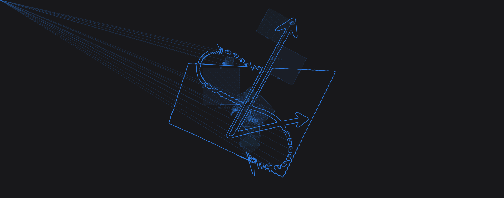

# Bifourcation

Draw a path. Watch Fourier terms rebuild it through rotors in the oriented drawing plane `e₁e₂`. Listen to the drawing play itself.

<p align="center">
  
</p>

Bifourcation is an interactive Fourier drawing app built around geometric algebra. It treats the drawing surface as a real oriented plane generated by `e₁` and `e₂`, with `e₁e₂` as the bivector that generates rotation.

The central idea is:

```txt
Fourier terms advanced by rotors in the e₁e₂ plane.
```

## What it does

- Draw freehand strokes on a canvas.
- Import images and trace their edges into drawable strokes.
- Choose stroke color and pen width.
- Convert each stroke into an evenly sampled path.
- Compute Fourier terms for each stroke.
- Animate each stroke in order.
- Preserve completed stroke reconstructions while later strokes animate.
- Visualize Fourier components as rotor-driven disks, oriented blades, or companion vectors.
- Show tiny rotor labels so the animation keeps pointing back to the math.
- Generate optional path-driven sound from the drawing.
- Persist user preferences across refreshes.
- Export/share snapshots of the current reconstruction.

## Why this exists

Most Fourier drawing demos use complex numbers. That is mathematically valid, but it can make rotation feel like it happens in a mysterious “imaginary” place.

Bifourcation uses geometric algebra instead.

The drawing plane has basis vectors:

```txt
e₁, e₂
```

Their geometric product is the unit bivector:

```txt
B = e₁e₂
```

This bivector is the oriented drawing plane.

Because:

```txt
B² = (e₁e₂)(e₁e₂) = -1
```

the bivector `B` can play the role that `i` plays in complex Fourier analysis. But unlike `i`, it has direct geometric meaning:

```txt
B = e₁e₂ = the oriented plane of rotation
```

So instead of introducing an unexplained imaginary axis, Bifourcation uses the plane that was already there.

## Plane-phase rotation

In geometric algebra, the standard general-purpose rotor formula for rotating a vector is the sandwich product:

```txt
v' = RvR⁻¹
```

with a half-angle rotor:

```txt
R = e^(-Bθ/2)
```

That is the general rotor action used across dimensions.

Bifourcation works in a specific 2D drawing plane. In this plane, the unit bivector:

```txt
B = e₁e₂
```

acts like the plane’s intrinsic 90° turn. One-sided multiplication by:

```txt
e^(Bθ)
```

is a valid plane-phase rotation in this 2D setting.

So the project uses the 2D phase action:

```txt
v' = v e^(Bθ)
```

or equivalently, after identifying the drawing signal with the scalar-plus-bivector plane:

```txt
z' = z e^(Bθ)
```

This is why the Fourier phase uses the full angle `θ`, not the sandwich rotor half-angle.

The important distinction is:

```txt
General GA vector rotation:
  v' = RvR⁻¹
  R = e^(-Bθ/2)

2D plane-phase Fourier rotation:
  v' = v e^(Bθ)
  or
  z' = z e^(Bθ)
```

Both are legitimate geometric algebra operations. Bifourcation uses the second one because the app is a 2D Fourier drawing system.

## The rotor exponential

The cleanest rotor statement is:

```txt
R(θ) = e^(Bθ)
```

where:

```txt
B = e₁e₂
```

is the oriented plane of rotation.

The exponential packages:

```txt
plane + angle
```

into a finite rotation operator.

Because:

```txt
B² = -1
```

the exponential expands into:

```txt
e^(Bθ) = cos(θ) + B sin(θ)
```

But the exponential is deeper than “cos plus sine.” It says that rotation is the accumulated effect of infinitesimal turning in a plane.

A non-trig way to read it is:

```txt
e^(Bθ) = limₙ→∞ (1 + Bθ/n)ⁿ
```

Each tiny factor:

```txt
1 + Bθ/n
```

means:

```txt
keep almost all of the current direction
+ add a tiny turn generated by the plane B
```

Doing that infinitely many times gives a smooth finite rotor.

So:

```txt
B
  = oriented plane / infinitesimal 90° turn

Bθ
  = plane-turn generator scaled by angle

e^(Bθ)
  = finite rotor produced by accumulating those tiny turns
```

For Bifourcation:

```txt
Rₖ(t) = e^(e₁e₂ · 2πkt)
```

which expands to:

```txt
Rₖ(t) = cos(2πkt) + e₁e₂ sin(2πkt)
```

## Rotor-first Fourier model

Each Fourier term is a coefficient advanced by a rotor in the `e₁e₂` plane.

The rotor for frequency `k` is:

```txt
Rₖ(t) = e^(e₁e₂ · 2πkt)
```

Each term is:

```txt
termₖ(t) = cₖRₖ(t)
```

and the reconstruction is:

```txt
f(t) = Σ cₖRₖ(t)
```

or, written as the exponential directly:

```txt
f(t) = Σ cₖe^(e₁e₂ · 2πkt)
```

where:

```txt
cₖ      = Fourier coefficient
Rₖ(t)   = rotor / phase action in the e₁e₂ plane
k       = rotation frequency and orientation
e₁e₂    = oriented drawing plane
```

In plain language:

```txt
Take the drawing.
Break it into Fourier coefficients.
For each coefficient:
  rotate it in the e₁e₂ plane,
  at its own frequency,
  by its own phase.
Add all of those rotating terms together.
The drawing reappears.
```

The circles you see are the visible traces of rotor-driven phase in the oriented `e₁e₂` plane.

## Even subalgebra interpretation

A drawing point can be written as a real vector:

```txt
v = x e₁ + y e₂
```

Multiplying by `e₁` maps it into the even subalgebra:

```txt
e₁v = e₁(xe₁ + ye₂)
    = x e₁² + y e₁e₂
    = x + y e₁e₂
```

So the familiar complex representation:

```txt
x + iy
```

becomes:

```txt
x + y e₁e₂
```

The even subalgebra:

```txt
span{1, e₁e₂}
```

is isomorphic to the complex numbers, but the “imaginary” direction is now explained geometrically:

```txt
e₁e₂ = the oriented drawing plane
```

Bifourcation does not use the even subalgebra because vectors cannot be rotated directly. It uses this scalar-plus-bivector phase space because Fourier coefficients naturally want complex-like phase behavior, and geometric algebra lets that phase be interpreted as the drawing plane itself.

## Visual modes

During animation, Bifourcation can show each rotor-driven Fourier component in three geometrically consistent ways.

### Disk mode

Disk mode is the most natural Fourier-symmetric view.

A Fourier term has constant magnitude while its phase rotates. Its endpoint traces circular motion. Disk mode leans into that rotational symmetry by representing the current rotor-driven term as an equal-area oriented disk glyph.

If the component vector has length:

```txt
|r|
```

then the associated oriented area represented by `r` and its `e₁e₂` companion has magnitude:

```txt
|r|²
```

Disk mode chooses radius `R` so that:

```txt
πR² = |r|²
```

therefore:

```txt
R = |r| / √π
```

This keeps the circular view honest: the disk is an equal-area glyph for the current term.

The disk is **not** the rotor itself. The rotor is:

```txt
Rₖ(t) = e^(e₁e₂ · 2πkt)
```

The disk is a visual glyph for the current rotor-driven term. The arrows mark term phase/orientation; they do not mean the plane `e₁e₂` itself is rotating.

### Blade mode

Blade mode is the most direct geometric-algebra view.

Given the current rotor-driven component vector:

```txt
r
```

the app draws its `e₁e₂`-rotated companion:

```txt
e₁e₂r
```

Because `e₁e₂` is a unit plane element, the companion has the same length:

```txt
|e₁e₂r| = |r|
```

and it is perpendicular to `r`.

So the blade spanned by `r` and `e₁e₂r` appears as a square:

```txt
area = |r|²
```

This does **not** mean bivectors are inherently squares. A bivector is oriented area. The square is a convenient representative of the oriented area generated by a component vector and its `e₁e₂` companion.

### Companion mode

Companion mode shows the `e₁e₂` action directly:

```txt
r → e₁e₂r
```

It keeps the primary component vector visible and draws its equal-length, 90°-rotated companion vector.

This mode is useful when you want to see `e₁e₂` acting as a plane rotation instead of looking at filled area.

### Translation component

The frequency-0 term is treated separately as translation / offset. It is not drawn as a rotating bivector blade because it does not represent a rotating phase component.

### Orientation cues

Positive and negative Fourier frequencies are drawn in the stroke’s color, because they belong to the same stroke. Their opposite orientations are distinguished by direction arrows and secondary texture cues.

- Negative blades use subtle diagonal hatching.
- Negative disks use subtle diagonal hatching.
- Negative companion vectors use dashed companion lines.
- Tiny labels identify early rotor terms as `cₖRₖ(t)`.

The three visual modes emphasize different truths:

```txt
Disk:
  shows the rotational symmetry of the Fourier phase action.

Blade:
  shows the oriented area associated with the current term.

Companion:
  shows e₁e₂ acting as a 90° rotation.
```

## What the glyphs are and are not

There is only one bivector plane in this 2D app:

```txt
e₁e₂
```

All disk, blade, and companion glyphs represent quantities associated with that same oriented plane.

The glyphs are visual bookkeeping for the Fourier reconstruction chain. They are not separate little physical planes floating in space.

Correct interpretation:

```txt
There is one plane: e₁e₂.
There are many Fourier terms advanced in that plane.
The disks/blades/companions are glyphs for the current rotor-driven terms.
```

Avoid this interpretation:

```txt
Each disk is a separate rotating plane.
The disk is the rotor.
The bivector plane itself rotates.
```

Better wording:

```txt
The rotor acts in the e₁e₂ plane.
The disk/blade is a glyph for the current rotor-driven term.
The arrows mark term phase/orientation.
```

## Rotor labels

During animation, Bifourcation labels the first few visible components with compact rotor notation:

```txt
cₖRₖ(t)
```

These labels are intentionally small. They are not meant to dominate the drawing. They are there to keep the viewer anchored to the idea that each visible component is:

```txt
a Fourier coefficient being advanced by a rotor
```

An equivalent expanded label would be:

```txt
cₖe^(e₁e₂ · 2πkt)
```

## Image tracing

Bifourcation can import an image and turn its visible edges into strokes.

This is not AI image recognition. It does not try to understand the image semantically. It uses a classic computer-vision pipeline entirely in the browser.

The high-contrast image pipeline is:

```txt
uploaded image
→ hidden canvas
→ grayscale pixels
→ light blur
→ threshold / foreground mask
→ boundary extraction
→ contour tracing
→ simplified paths
→ Stroke[]
→ Fourier / rotor reconstruction
```

Sobel-style edge detection remains useful as a fallback, but for high-contrast logos, icons, and silhouettes, threshold-based foreground boundary extraction usually gives cleaner contours.

The imported image is converted into the same stroke format as a hand-drawn path:

```ts
type Stroke = {
	color: string;
	width: number;
	points: Point[];
};
```

After import, hand-drawn strokes and image-traced strokes go through the same pipeline.

### Best image types

Image tracing works best with:

- icons
- logos
- sketches
- line art
- high-contrast images
- simple photos with clear silhouettes

It works less well with:

- low-contrast photos
- noisy images
- dense textures
- images where the subject blends into the background

The goal is not perfect photo vectorization. The goal is to turn an image into a drawable set of paths that can be decomposed through the same Fourier/geometric-algebra system.

## Sound

Bifourcation includes an optional Web Audio sound engine.

The sound is not intended to be a literal raw playback of Fourier coefficients. Raw sonification tends to become harsh, buzzy, or disconnected from the drawing. Instead, Bifourcation uses the drawing path and Fourier term data as musical control material.

The sound model is:

```txt
path position → pitch contour / stereo position
path tangent → melodic motion
path curvature → density / sparkle
Fourier amplitude → loudness
Fourier frequency sign → subtle stereo/orientation cue
current view → instrument character
```

Sound only plays while animation is active. Pausing animation stops the sound. Clearing the canvas stops and resets sound.

The current sound system is intentionally lightweight and browser-native. It uses the Web Audio API and does not depend on external audio files or libraries.

## Persistence

Bifourcation saves lightweight user preferences locally in the browser.

Currently persisted:

- pen color
- pen width
- rotor/bivector view
- sound on/off preference

Drawing data itself is not persisted. Refreshing the page keeps the user’s preferred tools, but it does not restore the canvas drawing.

Sound preference is remembered, but browser autoplay rules still apply. The app may need a user gesture before audio can actually start.

## Tech stack

- Vite
- React
- TypeScript
- Tailwind CSS
- HTML Canvas
- Web Audio API
- Browser `localStorage`

No backend is required.

## Getting started

Install dependencies:

```bash
npm install
```

Start the dev server:

```bash
npm run dev
```

Build for production:

```bash
npm run build
```

Preview the production build:

```bash
npm run preview
```

## Project structure

```txt
src/
  audio/
    soundEngine.ts

  components/
    DrawingCanvas.tsx
    RotorCanvas.tsx

  image/
    edgeTracing.ts

  math/
    clifford.ts
    evenSubalgebra.ts
    fourier.ts
    path.ts

  types/
    geometry.ts

  App.tsx
  main.tsx

public/
  bifourcation_logo.png
  bifourcation-snapshot.png
```

## Math pipeline

The app’s core data flow is:

```txt
raw pointer stroke
or traced image contour
→ ordered path points
→ evenly resampled path
→ vector / even-subalgebra signal
→ Fourier terms
→ rotor-driven reconstruction
```

### 1. Raw stroke data

Each stroke stores:

```ts
type Stroke = {
	color: string;
	width: number;
	points: Point[];
};
```

The visual stroke and the mathematical stroke are the same object. This lets the reconstruction inherit the original stroke color and width.

### 2. Resampling

Pointer events and traced contours are uneven. Slow hand movement creates many close samples; fast movement creates sparse samples. Edge-traced contours can also have irregular point spacing.

`src/math/path.ts` converts raw points into evenly spaced points along the path’s arc length.

This matters because Fourier reconstruction expects a clean ordered signal. It also matters for self-crossing strokes: the app follows the order in which the stroke was drawn or traced, not whichever nearby point happens to be geometrically closest.

### 3. Clifford algebra

`src/math/clifford.ts` defines the basis blades:

```txt
1
e₁
e₂
e₁e₂
```

The geometric product is derived from basis-blade multiplication rules. The important facts are:

```txt
e₁² = 1
e₂² = 1
e₁e₂ = -e₂e₁
(e₁e₂)² = -1
```

The inner and outer products are derived from grade projections of the geometric product.

For vectors:

```txt
ab = a · b + a ∧ b
```

In the app’s naming, the wedge/outer product is represented as `outerProduct`.

### 4. Even subalgebra

`src/math/evenSubalgebra.ts` derives the Fourier-friendly scalar-plus-bivector representation.

A point starts as a real vector:

```txt
v = x e₁ + y e₂
```

Then it can be converted into the even subalgebra:

```txt
e₁v = x + y e₁e₂
```

The rotor / phase exponential is:

```txt
R(θ) = e^(e₁e₂θ)
     = cos(θ) + e₁e₂ sin(θ)
```

This replaces the usual complex exponential with a geometric-algebra exponential generated by the drawing plane.

### 5. Fourier transform

`src/math/fourier.ts` computes DFT terms over the drawing signal.

Each Fourier term stores:

```ts
type FourierTerm = {
	frequency: number;
	coefficient: Multivector;
	amplitude: number;
	phase: number;
};
```

The reconstruction evaluates terms as rotor-driven multivectors and converts the result back into a vector for canvas drawing.

Conceptually:

```txt
coefficient cₖ
→ phase rotor Rₖ(t) = e^(e₁e₂ · 2πkt)
→ rotating term cₖRₖ(t)
→ sum all terms
→ reconstructed point
```

### 6. Image tracing

`src/image/edgeTracing.ts` turns an uploaded image into strokes.

The pipeline is intentionally simple and dependency-free:

```txt
ImageData
→ grayscale
→ blur
→ threshold / edge mask
→ boundary pixels
→ contour paths
→ simplified Stroke[]
```

The resulting strokes are appended to the canvas and treated like user-drawn strokes.

### 7. Rotor visualization

`src/components/RotorCanvas.tsx` renders the animated reconstruction.

It receives Fourier terms, evaluates their state at the current animation progress, and draws each component according to the selected view:

```txt
Disk       → rotationally symmetric equal-area disk glyph
Blade      → oriented area generated by r and e₁e₂r
Companion  → r and its e₁e₂-rotated companion
```

It also draws small `cₖRₖ(t)` labels on early components to keep the rotor model visible.

### 8. Path-driven audio

`src/audio/soundEngine.ts` turns the active animated stroke into sound.

The audio engine samples the current stroke progress and uses local path shape plus Fourier term data to shape the generated sound.

```txt
current path sample
→ normalized x/y position
→ tangent direction
→ curvature
→ Fourier term information
→ view-specific sound behavior
```

## App controls

### Bottom controls

The bottom bar contains only primary actions:

- Draw
- Animate / Pause
- Clear canvas

### Floating controls

The top-right drawer contains pen, image, and rotor-plane controls:

- Color palette
- Pen width
- Image import
- Rotor plane explanation
- Bivector/rotor view toggle: Disk, Blade, Companion

### Image import

The image card lets users upload an image and trace it into strokes using classic browser-native image processing.

Imported strokes use the current pen color and a capped version of the current pen width.

### Sound control

The speaker button toggles drawing sound.

Sound only plays while animation is active. Pausing animation stops the sound. Clearing the canvas stops and resets sound.

### Snapshot controls

The camera button opens a small export menu:

- Share snapshot
- Download PNG

Snapshots capture the canvas layers without including the UI controls. If the animation is running, taking a snapshot captures the current frame first, then pauses the app on that frame.

## Design philosophy

Bifourcation is intentionally not a generic Fourier demo.

The goal is to make the algebra visible and audible:

```txt
complex phase → rotor-driven Fourier components
imaginary unit → oriented plane e₁e₂
complex multiplication → geometric product / plane-phase action
negative sign → reversed orientation
circle-only visualization → disk, blade, and companion views
image recognition → simple mechanical edge tracing
raw sonification → path-driven musical drawing
```

The result should feel like a drawing app, a math visualization, an ambient instrument, and a small act of rebellion against hiding geometry behind notation.

## Current limitations

- The DFT implementation is simple and direct, not FFT-optimized.
- Image tracing uses a simple threshold / Sobel-style pipeline, not full Canny edge detection or advanced vectorization.
- Image tracing works best on high-contrast images and may produce noisy contours on photos.
- Animation export currently supports snapshots, not video or GIF.
- Strokes are animated sequentially, not simultaneously.
- Sound is generated live through the Web Audio API and is not currently exported with snapshots.
- Preferences are persisted, but drawings are not currently saved.
- The app uses the drawing plane only; higher-dimensional Clifford algebras are out of scope for the current version.

## Possible next steps

- Add video/GIF export.
- Add animation speed controls.
- Add term-count controls.
- Add image tracing controls for threshold, contour count, and simplification.
- Add sound controls for volume, density, and instrument character.
- Add optional labels for `e₁`, `e₂`, and `e₁e₂`.
- Add onboarding overlays explaining rotors, equal-area disks, blades, and companion vectors.
- Add local save/load for drawings.
- Add stroke editing or undo.

## Name

**Bifourcation** combines:

```txt
bivector
Fourier
bifurcation
```

It is a Fourier reconstruction app that splits a drawing into oriented-plane rotor components.
